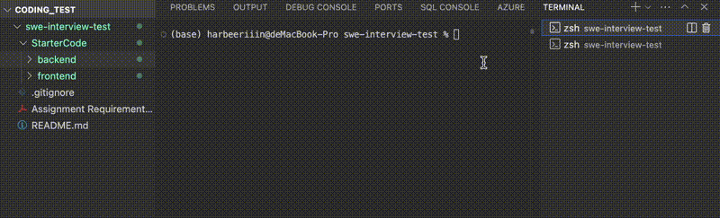
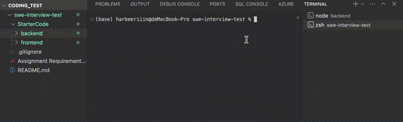
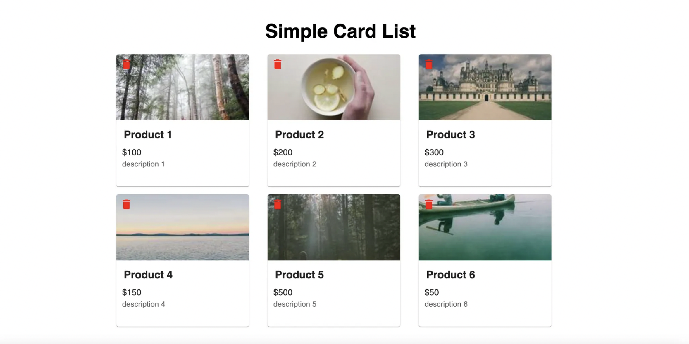
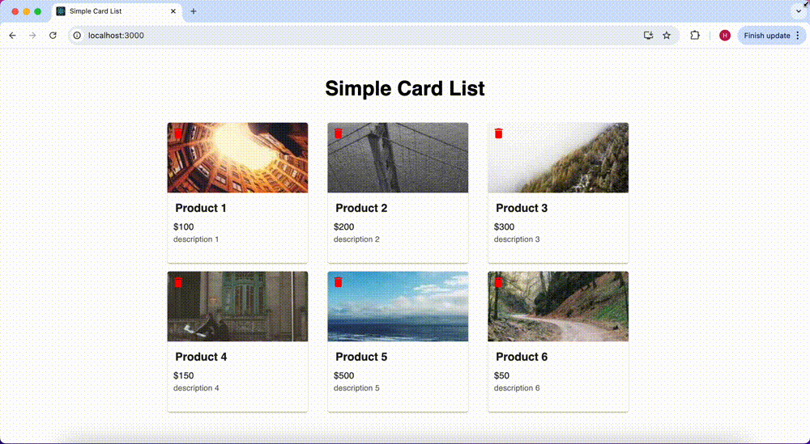

# Introduction

A simple web application that displays a list of products in card format. Users should be able to view product cards and delete cards.


+ **frontend:** 

  1. The responsive frontend adjusts card layout with window size.

  2. The card container is always be centered.
  3. Handle errors including network error and  product not found.

+ **backend:** 

  1. `GET /api/products`

     + Fetch the list of products.

     + Each product should include a randomly fetched image URL.

  2. `DELETE /api/products/:id`

     **Logically** delete a product by its ID, add a field called "status", where:

     - `status = 1`: Product is not deleted.
     - `status = 0`: Product is deleted.

  3. Use  `cors` to enable CORS.

     

# How to launch the Application


## Get the code

1. Clone this repository
2. Navigate to the ‘StarterCode' directory

```bash
cd StarterCode
```

## launch the backend

1. Navigate the the `backend` directory
2. Run `npm install` to install all dependencies
3. Run  `npm start` to launch the backend server

```bash
cd backend
npm install
npm start
```

Once the backend is successfully started, it listens on the default port **3002**. You can change the port by setting the `PORT`  variable.



## launch the frontend

1. Navigate the the `frontend` directory
2. Run `npm install` to install all dependencies
3. Run  `npm start` to launch the frontend server

```bash
cd frontend
npm install
npm start
```




Once both the frontend and backend are successfully launched, visit [`http://localhost:3000/`](http://localhost:3000/) and you can access the Card List page.




# Demo



